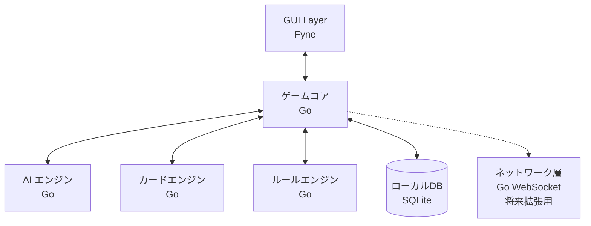

# 設計文書

## 概要

「めめめのくらげ TCG」は、macOS 向けのネイティブデスクトップアプリケーションです。オフラインでの CPU 対戦をメインとし、複雑なゲームルールの処理、直感的なユーザーインターフェース、将来的なオンライン対戦への拡張性を提供します。

## アーキテクチャ

### システム全体構成



### 技術スタック

- **GUI フレームワーク**: Fyne (Go ネイティブ GUI)
- **コア言語**: Go 1.21+
- **ローカルデータベース**: SQLite + GORM
- **AI エンジン**: Go による独自実装
- **状態管理**: Go channels + sync パッケージ
- **ネットワーク**: Gorilla WebSocket (将来拡張用)
- **ビルドツール**: Go modules + macOS 向けバイナリ生成

## コンポーネントとインターフェース

### 1. カードシステム

#### カードデータモデル

```go
type CardType string

const (
    CardTypeFriend  CardType = "friend"
    CardTypeSupport CardType = "support"
    CardTypeField   CardType = "field"
)

type CardColor string
type Rarity string
type Timing string

const (
    TimingMain        Timing = "main"
    TimingCounter     Timing = "counter"
    TimingMainCounter Timing = "main_counter"
)

type Cost struct {
    Total     int            `json:"total"`
    ColorCost map[string]int `json:"color_cost"`
}

type BaseCard struct {
    ID          string    `gorm:"primaryKey" json:"id"`
    CardNo      string    `gorm:"uniqueIndex" json:"card_no"`
    Name        string    `json:"name"`
    Type        CardType  `json:"type"`
    Color       CardColor `json:"color"`
    Cost        Cost      `gorm:"type:json" json:"cost"`
    Attribute   *string   `json:"attribute,omitempty"`
    Effect      string    `json:"effect"`
    Rarity      Rarity    `json:"rarity"`
    FlavorText  string    `json:"flavor_text"`
    EnergyIcon  int       `json:"energy_icon"`
    CreatedAt   time.Time `json:"created_at"`
    UpdatedAt   time.Time `json:"updated_at"`
}

type FriendCard struct {
    BaseCard
    Power int `json:"power"`
}

type SupportCard struct {
    BaseCard
    Timing Timing `json:"timing"`
}

type FieldCard struct {
    BaseCard
}
```

#### カード管理サービス

```go
type CardService struct {
    db *gorm.DB
}

func NewCardService(db *gorm.DB) *CardService {
    return &CardService{db: db}
}

func (s *CardService) GetCardByID(id string) (*BaseCard, error)
func (s *CardService) GetCardsByType(cardType CardType) ([]BaseCard, error)
func (s *CardService) ValidateDeck(deck []BaseCard) (*DeckValidationResult, error)
func (s *CardService) SearchCards(query CardSearchQuery) ([]BaseCard, error)
func (s *CardService) LoadInitialCards() error
```

### 2. ゲーム状態管理

#### ゲーム状態モデル

```go
type GamePhase string

const (
    PhaseStart  GamePhase = "start"
    PhaseDraw   GamePhase = "draw"
    PhaseEnergy GamePhase = "energy"
    PhaseMain   GamePhase = "main"
    PhaseEnd    GamePhase = "end"
)

type PlayerType string

const (
    PlayerTypeHuman PlayerType = "human"
    PlayerTypeAI    PlayerType = "ai"
)

type GameState struct {
    ID            string      `json:"id"`
    Players       [2]Player   `json:"players"`
    CurrentPlayer int         `json:"current_player"` // 0 or 1
    Phase         GamePhase   `json:"phase"`
    Turn          int         `json:"turn"`
    Winner        *int        `json:"winner,omitempty"`
    CreatedAt     time.Time   `json:"created_at"`
    UpdatedAt     time.Time   `json:"updated_at"`
    mu            sync.RWMutex
}

type Player struct {
    ID                  string      `json:"id"`
    Name                string      `json:"name"`
    Type                PlayerType  `json:"type"`
    Deck                []BaseCard  `json:"deck"`
    Hand                []BaseCard  `json:"hand"`
    BattleArea          []BaseCard  `json:"battle_area"`
    FieldArea           []BaseCard  `json:"field_area"`
    EnergyArea          []BaseCard  `json:"energy_area"`
    NegativeEnergyArea  []BaseCard  `json:"negative_energy_area"`
    Trash               []BaseCard  `json:"trash"`
}
```

#### ゲーム状態管理サービス

```go
type GameStateService struct {
    games map[string]*GameState
    mu    sync.RWMutex
}

func NewGameStateService() *GameStateService {
    return &GameStateService{
        games: make(map[string]*GameState),
    }
}

func (s *GameStateService) CreateGame(humanPlayer, aiPlayer string) (*GameState, error)
func (s *GameStateService) GetGameState(gameID string) (*GameState, error)
func (s *GameStateService) UpdateGameState(gameID string, updateFunc func(*GameState) error) error
func (s *GameStateService) DeleteGame(gameID string) error
func (s *GameStateService) SaveGameState(gameID string) error
func (s *GameStateService) LoadGameState(gameID string) (*GameState, error)
```

### 3. ゲームルールエンジン

#### ルールエンジンアーキテクチャ

```go
type GameEngine struct {
    ruleProcessor   *RuleProcessor
    effectProcessor *EffectProcessor
    phaseManager    *PhaseManager
    gameState       *GameStateService
}

func NewGameEngine(gameState *GameStateService) *GameEngine {
    return &GameEngine{
        ruleProcessor:   NewRuleProcessor(),
        effectProcessor: NewEffectProcessor(),
        phaseManager:    NewPhaseManager(),
        gameState:       gameState,
    }
}

func (e *GameEngine) ProcessAction(gameID string, action GameAction) (*GameResult, error)
func (e *GameEngine) ValidateAction(gameID string, action GameAction) error
func (e *GameEngine) ProcessPhaseTransition(gameID string) error
func (e *GameEngine) ProcessAITurn(gameID string) error

type RuleProcessor struct{}

func NewRuleProcessor() *RuleProcessor {
    return &RuleProcessor{}
}

func (r *RuleProcessor) ValidateCardPlay(card BaseCard, gameState *GameState) error
func (r *RuleProcessor) ValidateAttack(attackerID string, gameState *GameState) error
func (r *RuleProcessor) ValidateBlock(blockerID string, gameState *GameState) error
func (r *RuleProcessor) CheckWinCondition(gameState *GameState) *int
```

#### アクションシステム

```go
type GameActionType string

const (
    ActionPlayCard   GameActionType = "play_card"
    ActionAttack     GameActionType = "attack"
    ActionBlock      GameActionType = "block"
    ActionUseEffect  GameActionType = "use_effect"
    ActionEndPhase   GameActionType = "end_phase"
)

type GameAction struct {
    Type     GameActionType `json:"type"`
    PlayerID string         `json:"player_id"`
    Data     interface{}    `json:"data"`
}

type PlayCardAction struct {
    CardID      string            `json:"card_id"`
    CostPayment map[string]string `json:"cost_payment"` // energy card IDs to rest
}

type AttackAction struct {
    AttackerID string  `json:"attacker_id"`
    Target     *string `json:"target,omitempty"` // nil for direct attack
}

type BlockAction struct {
    BlockerID string `json:"blocker_id"`
}

type GameResult struct {
    Success     bool        `json:"success"`
    Message     string      `json:"message"`
    NewState    *GameState  `json:"new_state,omitempty"`
    Events      []GameEvent `json:"events"`
}

type GameEvent struct {
    Type        string      `json:"type"`
    Description string      `json:"description"`
    Data        interface{} `json:"data"`
}
```

### 4. AI エンジン

#### AI プレイヤーアーキテクチャ

```go
type AIEngine struct {
    difficulty AIDifficulty
    strategy   AIStrategy
    evaluator  *PositionEvaluator
}

type AIDifficulty string

const (
    DifficultyEasy   AIDifficulty = "easy"
    DifficultyMedium AIDifficulty = "medium"
    DifficultyHard   AIDifficulty = "hard"
)

type AIStrategy interface {
    SelectAction(gameState *GameState, playerIndex int) (GameAction, error)
    EvaluatePosition(gameState *GameState, playerIndex int) float64
}

func NewAIEngine(difficulty AIDifficulty) *AIEngine {
    return &AIEngine{
        difficulty: difficulty,
        strategy:   NewBasicStrategy(difficulty),
        evaluator:  NewPositionEvaluator(),
    }
}

func (ai *AIEngine) MakeMove(gameState *GameState, playerIndex int) (GameAction, error)
func (ai *AIEngine) ShouldBlock(gameState *GameState, playerIndex int) (bool, string)
func (ai *AIEngine) SelectCardsToPlay(gameState *GameState, playerIndex int) ([]string, error)
```

#### AI 戦略実装

```go
type BasicStrategy struct {
    difficulty AIDifficulty
    random     *rand.Rand
}

func NewBasicStrategy(difficulty AIDifficulty) *BasicStrategy {
    return &BasicStrategy{
        difficulty: difficulty,
        random:     rand.New(rand.NewSource(time.Now().UnixNano())),
    }
}

func (s *BasicStrategy) SelectAction(gameState *GameState, playerIndex int) (GameAction, error)
func (s *BasicStrategy) EvaluatePosition(gameState *GameState, playerIndex int) float64
func (s *BasicStrategy) prioritizeTargets(gameState *GameState, playerIndex int) []string
func (s *BasicStrategy) calculateCardValue(card BaseCard, gameState *GameState) float64
```

### 5. ユーザーインターフェース

#### GUI アーキテクチャ (Fyne)

```go
type App struct {
    fyneApp    fyne.App
    mainWindow fyne.Window
    gameUI     *GameUI
    deckUI     *DeckBuilderUI
    menuUI     *MenuUI
}

type GameUI struct {
    container     *container.Border
    gameBoard     *GameBoard
    playerArea    *PlayerArea
    opponentArea  *PlayerArea
    handArea      *HandArea
    phaseDisplay  *PhaseIndicator
    actionButtons *ActionButtons
}

type GameBoard struct {
    battleArea    *BattleArea
    energyArea    *EnergyArea
    negativeArea  *NegativeEnergyArea
    deckArea      *DeckArea
    trashArea     *TrashArea
}

func NewApp() *App {
    app := app.New()
    app.SetIcon(resourceIconPng)

    return &App{
        fyneApp:    app,
        mainWindow: app.NewWindow("めめめのくらげ TCG"),
    }
}

func (a *App) ShowMainMenu()
func (a *App) ShowDeckBuilder()
func (a *App) ShowGameScreen(gameState *GameState)
func (a *App) ShowCardCollection()
```

#### プロジェクト構成

```
cmd/
└── tcg/
    └── main.go
internal/
├── ui/
│   ├── app.go
│   ├── game/
│   │   ├── game_board.go
│   │   ├── player_area.go
│   │   ├── battle_area.go
│   │   ├── hand_area.go
│   │   └── phase_indicator.go
│   ├── cards/
│   │   ├── card_widget.go
│   │   ├── card_list.go
│   │   └── card_detail.go
│   ├── deck/
│   │   ├── deck_builder.go
│   │   ├── deck_list.go
│   │   └── card_collection.go
│   └── components/
│       ├── button.go
│       ├── modal.go
│       └── loading.go
├── game/
│   ├── engine.go
│   ├── state.go
│   ├── rules.go
│   └── ai.go
├── cards/
│   ├── service.go
│   ├── models.go
│   └── repository.go
└── database/
    ├── sqlite.go
    └── migrations.go
pkg/
├── types/
│   ├── game.go
│   ├── cards.go
│   └── ui.go
└── utils/
    ├── shuffle.go
    └── validation.go
assets/
├── cards/
│   └── images/
├── icons/
└── sounds/
```

#### 状態管理

```go
type AppState struct {
    currentGame   *GameState
    cardCollection []BaseCard
    selectedDeck   []BaseCard
    uiState       UIState
    mu            sync.RWMutex
}

type UIState struct {
    selectedCard     *BaseCard
    showCardDetail   bool
    currentModal     string
    gamePhase        GamePhase
    waitingForInput  bool
    availableActions []GameActionType
}

func NewAppState() *AppState {
    return &AppState{
        cardCollection: make([]BaseCard, 0),
        selectedDeck:   make([]BaseCard, 0),
        uiState:       UIState{},
    }
}

func (s *AppState) UpdateGameState(newState *GameState)
func (s *AppState) SelectCard(card *BaseCard)
func (s *AppState) ShowModal(modalType string)
func (s *AppState) SetAvailableActions(actions []GameActionType)
```

## データモデル

### データベーススキーマ

#### カードテーブル

```sql
CREATE TABLE cards (
  id UUID PRIMARY KEY DEFAULT gen_random_uuid(),
  card_no VARCHAR(20) UNIQUE NOT NULL,
  name VARCHAR(100) NOT NULL,
  type VARCHAR(20) NOT NULL CHECK (type IN ('friend', 'support', 'field')),
  color VARCHAR(20) NOT NULL,
  cost JSONB NOT NULL,
  attribute VARCHAR(50),
  effect TEXT NOT NULL,
  power INTEGER, -- friend cards only
  timing VARCHAR(20), -- support cards only
  rarity VARCHAR(20) NOT NULL,
  flavor_text TEXT,
  energy_icon INTEGER NOT NULL DEFAULT 1,
  created_at TIMESTAMP DEFAULT NOW(),
  updated_at TIMESTAMP DEFAULT NOW()
);
```

#### デッキテーブル

```sql
CREATE TABLE decks (
  id UUID PRIMARY KEY DEFAULT gen_random_uuid(),
  user_id UUID NOT NULL,
  name VARCHAR(100) NOT NULL,
  cards JSONB NOT NULL, -- array of {cardId, quantity}
  is_valid BOOLEAN DEFAULT FALSE,
  created_at TIMESTAMP DEFAULT NOW(),
  updated_at TIMESTAMP DEFAULT NOW()
);
```

#### ゲームテーブル

```sql
CREATE TABLE games (
  id UUID PRIMARY KEY DEFAULT gen_random_uuid(),
  player1_id UUID NOT NULL,
  player2_id UUID NOT NULL,
  state JSONB NOT NULL,
  status VARCHAR(20) DEFAULT 'active',
  winner_id UUID,
  created_at TIMESTAMP DEFAULT NOW(),
  updated_at TIMESTAMP DEFAULT NOW()
);
```

### SQLite データ構造 (オフライン用)

```sql
-- SQLite用のスキーマ（PostgreSQL構文をSQLite用に調整）
CREATE TABLE cards (
  id TEXT PRIMARY KEY,
  card_no TEXT UNIQUE NOT NULL,
  name TEXT NOT NULL,
  type TEXT NOT NULL CHECK (type IN ('friend', 'support', 'field')),
  color TEXT NOT NULL,
  cost TEXT NOT NULL, -- JSON文字列として保存
  attribute TEXT,
  effect TEXT NOT NULL,
  power INTEGER, -- friend cards only
  timing TEXT, -- support cards only
  rarity TEXT NOT NULL,
  flavor_text TEXT,
  energy_icon INTEGER NOT NULL DEFAULT 1,
  created_at DATETIME DEFAULT CURRENT_TIMESTAMP,
  updated_at DATETIME DEFAULT CURRENT_TIMESTAMP
);

CREATE TABLE decks (
  id TEXT PRIMARY KEY,
  name TEXT NOT NULL,
  cards TEXT NOT NULL, -- JSON文字列として保存
  is_valid BOOLEAN DEFAULT FALSE,
  created_at DATETIME DEFAULT CURRENT_TIMESTAMP,
  updated_at DATETIME DEFAULT CURRENT_TIMESTAMP
);

CREATE TABLE game_saves (
  id TEXT PRIMARY KEY,
  name TEXT NOT NULL,
  state TEXT NOT NULL, -- JSON文字列として保存
  created_at DATETIME DEFAULT CURRENT_TIMESTAMP,
  updated_at DATETIME DEFAULT CURRENT_TIMESTAMP
);

CREATE TABLE settings (
  key TEXT PRIMARY KEY,
  value TEXT NOT NULL,
  updated_at DATETIME DEFAULT CURRENT_TIMESTAMP
);
```

### 将来拡張用ネットワーク層

```go
// 将来のオンライン対戦用インターフェース
type NetworkService struct {
    enabled bool
    client  *websocket.Conn
    server  *http.Server
}

func NewNetworkService() *NetworkService {
    return &NetworkService{enabled: false}
}

// 将来実装予定
func (n *NetworkService) EnableOnlineMode() error
func (n *NetworkService) ConnectToServer(address string) error
func (n *NetworkService) StartLocalServer(port int) error
func (n *NetworkService) SendGameAction(action GameAction) error
func (n *NetworkService) ReceiveGameAction() (GameAction, error)
```

## エラーハンドリング

### エラー分類

```go
type GameErrorType string

const (
    ErrInvalidAction       GameErrorType = "INVALID_ACTION"
    ErrInsufficientCost    GameErrorType = "INSUFFICIENT_COST"
    ErrCardNotFound        GameErrorType = "CARD_NOT_FOUND"
    ErrGameNotFound        GameErrorType = "GAME_NOT_FOUND"
    ErrPlayerNotAuthorized GameErrorType = "PLAYER_NOT_AUTHORIZED"
    ErrDatabaseError       GameErrorType = "DATABASE_ERROR"
    ErrAIError             GameErrorType = "AI_ERROR"
    ErrUIError             GameErrorType = "UI_ERROR"
)

type GameError struct {
    Type    GameErrorType `json:"type"`
    Message string        `json:"message"`
    Details interface{}   `json:"details,omitempty"`
}

func (e *GameError) Error() string {
    return fmt.Sprintf("[%s] %s", e.Type, e.Message)
}

func NewGameError(errorType GameErrorType, message string, details interface{}) *GameError {
    return &GameError{
        Type:    errorType,
        Message: message,
        Details: details,
    }
}
```

### エラーハンドリング戦略

1. **アプリケーション層**: エラーダイアログとユーザー通知
2. **ゲームエンジン**: 構造化ログとエラー追跡
3. **データベース**: トランザクション管理と自動復旧
4. **ゲーム状態**: 不整合検出と自動修復
5. **AI エンジン**: フォールバック戦略と安全な動作

## テスト戦略

### テストピラミッド

1. **ユニットテスト** (70%)

   - カードロジック
   - ゲームルール
   - AI エンジン
   - ユーティリティ関数

2. **統合テスト** (20%)

   - データベース操作
   - ゲームエンジン全体
   - UI コンポーネント

3. **E2E テスト** (10%)
   - ゲームフロー全体
   - ユーザーシナリオ
   - AI 対戦フロー

### テストツール

```go
// テスト用の構造体とヘルパー
type TestGameState struct {
    *GameState
    testHelper *TestHelper
}

type TestHelper struct {
    db     *gorm.DB
    engine *GameEngine
}

func NewTestHelper() *TestHelper {
    // テスト用のインメモリSQLiteデータベース
    db, _ := gorm.Open(sqlite.Open(":memory:"), &gorm.Config{})
    return &TestHelper{
        db:     db,
        engine: NewGameEngine(NewGameStateService()),
    }
}

func (h *TestHelper) CreateTestGame() *GameState
func (h *TestHelper) CreateTestCard(cardType CardType) BaseCard
func (h *TestHelper) SimulateAIMove(gameState *GameState) GameAction
```

- **ユニット**: Go 標準 testing + testify
- **統合**: Go 標準 testing + SQLite in-memory
- **E2E**: Go 標準 testing + Fyne test framework
- **パフォーマンス**: Go benchmark testing

## セキュリティ考慮事項

### データ保護

```go
type SecurityService struct {
    encryptionKey []byte
    validator     *InputValidator
}

func NewSecurityService() *SecurityService {
    return &SecurityService{
        encryptionKey: generateEncryptionKey(),
        validator:     NewInputValidator(),
    }
}

func (s *SecurityService) EncryptSaveData(data []byte) ([]byte, error)
func (s *SecurityService) DecryptSaveData(data []byte) ([]byte, error)
func (s *SecurityService) ValidateUserInput(input string) error
func (s *SecurityService) SanitizeCardData(card *BaseCard) error
```

### データ検証

1. **入力検証**: すべてのユーザー入力をサニタイズ
2. **ゲーム状態検証**: 不正な状態変更を検出
3. **アクション検証**: ルール違反を防止
4. **セーブデータ保護**: 暗号化によるセーブデータの改ざん防止

### チート対策（オフライン環境）

1. **ルール検証**: すべてのアクションをゲームエンジンで検証
2. **状態整合性**: ゲーム状態の論理的整合性チェック
3. **セーブデータ検証**: セーブデータの改ざん検出
4. **AI 行動検証**: AI の不正な行動を防止

## パフォーマンス最適化

### GUI 最適化

```go
type PerformanceOptimizer struct {
    cardImageCache map[string]*fyne.Resource
    renderPool     *sync.Pool
    updateThrottle *time.Ticker
}

func NewPerformanceOptimizer() *PerformanceOptimizer {
    return &PerformanceOptimizer{
        cardImageCache: make(map[string]*fyne.Resource),
        renderPool:     &sync.Pool{New: func() interface{} { return &RenderContext{} }},
        updateThrottle: time.NewTicker(16 * time.Millisecond), // 60 FPS
    }
}
```

1. **画像キャッシュ**: カード画像のメモリキャッシュ
2. **レンダリング最適化**: 不要な再描画の削減
3. **仮想化**: 大量のカードリスト表示の最適化
4. **遅延読み込み**: 必要な時のみリソース読み込み

### ゲームエンジン最適化

```go
type GameEngineOptimizer struct {
    stateCache    *lru.Cache
    actionPool    *sync.Pool
    ruleCache     map[string]*RuleResult
    aiThinkTime   time.Duration
}

func (o *GameEngineOptimizer) OptimizeGameState(state *GameState) *GameState
func (o *GameEngineOptimizer) CacheRuleResult(rule string, result *RuleResult)
func (o *GameEngineOptimizer) ThrottleAIThinking(difficulty AIDifficulty) time.Duration
```

1. **状態キャッシュ**: ゲーム状態の効率的なキャッシュ
2. **ルールキャッシュ**: 頻繁に使用されるルール判定結果のキャッシュ
3. **オブジェクトプール**: メモリ割り当ての最適化
4. **AI 思考時間制御**: 難易度に応じた AI の応答時間調整

### データベース最適化

```go
type DatabaseOptimizer struct {
    connectionPool *sql.DB
    queryCache     map[string]*sql.Stmt
    indexHints     map[string]string
}

func (o *DatabaseOptimizer) OptimizeCardQueries() error
func (o *DatabaseOptimizer) CreateIndexes() error
func (o *DatabaseOptimizer) PrepareStatements() error
```

1. **インデックス最適化**: カード検索とデッキ操作の高速化
2. **プリペアドステートメント**: クエリの事前準備
3. **バッチ処理**: 複数操作の一括実行
4. **トランザクション最適化**: データベース操作の効率化

### メモリ管理最適化

```go
type MemoryManager struct {
    cardPool     *sync.Pool
    statePool    *sync.Pool
    gcThreshold  int64
    lastGC       time.Time
}

func (m *MemoryManager) ReuseCard() *BaseCard
func (m *MemoryManager) ReturnCard(card *BaseCard)
func (m *MemoryManager) TriggerGCIfNeeded()
func (m *MemoryManager) MonitorMemoryUsage() int64
```

1. **オブジェクトプール**: カードオブジェクトの再利用
2. **ガベージコレクション制御**: 適切なタイミングでのGC実行
3. **メモリ使用量監視**: メモリリークの検出と対策
4. **リソース管理**: 画像やサウンドリソースの効率的な管理
